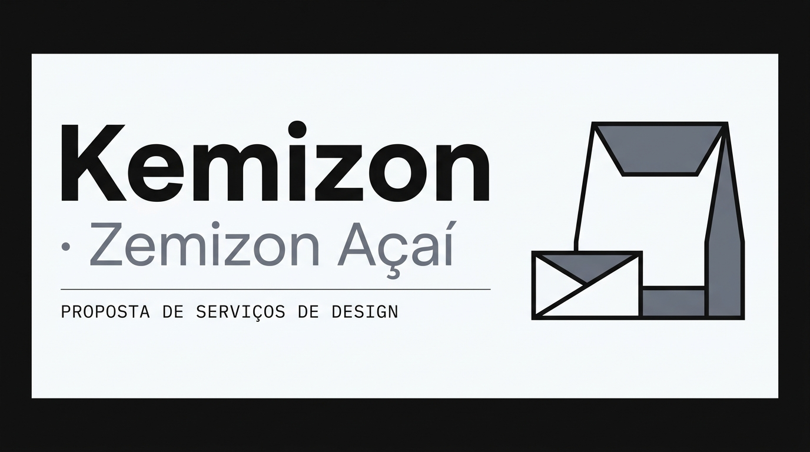

# Kemizon · Zemizon Açaí — Proposta de Serviços de Design



## 🎯 Sobre o Projeto

Este repositório contém a proposta comercial de serviços de design para o **lançamento da linha de pó de açaí da Kemizon**, desenvolvida em continuidade à identidade visual já validada com o produto de acerola (Zemizon).

O projeto cobre o primeiro ciclo completo de comunicação do novo produto — redes sociais, embalagens, mockups e materiais comerciais — garantindo coerência visual entre todos os pontos de contato da marca desde a primeira arte publicada.

**Cliente:** Kemizon — A/C Weliton  
**Elaborado por:** Taylor Alves  
**Data:** Agosto / 2026  
**Lançamento via:** Centelha SP

---

## 📦 Escopo & Entregáveis

| # | Serviço | Qtd. | Valor |
|---|---------|------|-------|
| 01 | Artes para redes sociais | 34 un. | R$ 3.400 |
| 02 | Embalagem primária | 1 peça | R$ 2.800 |
| 03 | Embalagem secundária | 1 peça | R$ 1.800 |
| 04 | Mockups | 25 un. | R$ 1.750 |
| 05 | Lâmina comercial para drogarias | 1 peça | R$ 700 |
| 06 | Arte para WhatsApp Business | 1 peça | R$ 250 |
| 07 | Hero banner para o site | 1 peça | R$ 600 |
| | **Total** | | **R$ 11.300** |

---

## ✨ Sobre a Proposta

- **Identidade em continuidade:** o sistema visual do açaí nasce como extensão natural da Zemizon — reconhecível, mas com identidade própria, distinta da acerola.
- **Primeiro ciclo completo:** todos os pontos de contato cobertos desde o lançamento (embalagem, site, redes, comercial, WhatsApp).
- **Rodadas de ajuste:** 2 por serviço incluídas.
- **Pagamento:** 40% na aprovação · 30% na primeira entrega · 30% na entrega final.
- **Prazo:** embalagens, hero, lâmina e WhatsApp nas primeiras semanas; redes sociais e mockups em ~3 meses.

---

## 🛠️ Tecnologias da Landing Page

- **HTML5** & Semantic HTML
- **Tailwind CSS** (via CDN)
- **Geist Sans + Geist Mono** (tipografia)
- Design system Ice & Ash: `#F9FAFB` · `#212121` · `#6B7280` · `#E5E7EB`

## 🚀 Como Visualizar

1. Clone o repositório:
   ```bash
   git clone https://github.com/TaylorAlves/Kemizon-acai.git
   ```
2. Abra `kemizon-acai.html` em qualquer navegador moderno.

---

## 📄 Licença

Este projeto está sob a licença MIT. Veja o arquivo [LICENSE](LICENSE) para mais detalhes.

---
Desenvolvido com foco em estratégia e design por **Taylor Alves**.
